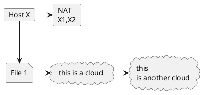

> :warning: **NOTE:**  Under Construction :construction:

# Network Address Translation

NAT creates mapping (binding) between inside and outside address and ports.
Mappings are temporary and expire after a TCP connection is closed with a `FIN` or inactivity  in case of UDP.

The fact NAT operates at layer 4 with TCP, does not mean the session is no longer end-to-end.
NAT never maintains a transmission control block or maps sequence number. Since it never performs retransmissions or acknowledgments, the TCP connection is with end-to-end full control and reliability.

When NAT creates a new mapping between the source, example 10.0.0.1:41223 and 18.34.6.2:33123, rewrites the packet with the new data, modifying:

```
Layer-3 Checksum
source address
destination address
Layer-4 Checksum
source port
destination port
```

### Classification

Older NAT terminology classified as:
* full cone
* restricted cone
* symmetric

Modern terminology, by BEHAVE working group, characterize the type of address mapping and filtering employed.

```
                                     E
  +------+                 +------+  x
  |  Y1  |                 |  Y2  |  t
  +--+---+                 +---+--+  e
     | Y1:y1            Y2:y2  |     r
     +----------+   +----------+     n
                |   |                a
        X1':x1' |   | X2':x2'        l
             +--+---+-+
.............|   NAT  |...............
             +--+---+-+              I
                |   |                n
            X:x |   | X:x            t
               ++---++               e
               |  X  |               r
               +-----+               n
                                     a
                                     l
```
Address and Port Mapping from [rfc4787](https://tools.ietf.org/html/rfc4787#section-4.1) for `ADDRESS:port`

* **Endpoint-Independent Mapping** (EIM NAT)

Formula: `X1':x1' = X2':x2' for all Y;y`. The mapping used is dependent only on the source address/port `X:x`, independent of the destination address/port.

* **Address-Dependent Mapping** (ADM NAT)

Formula: `X1':x1' = X2':x2' if only if Y2=Y1`. The mapping used is dependent on the source address/port `X:x` as well as the destination the address `Y`.

* **Address and Port Dependent Mapping** (APDM NAT)

Formula: `X1':x1' = X2':x2' if only if Y2:y2=Y1:y1`. The mapping used is dependent both on the source and destination address/port.

* **Hairpin Support** (Tromboning NAT)

If an internal host can send packets to another internal host using the external address of the other host. The NAT must look up two mappings to determine the destination.

* **IP Address Pooling options**


------------------------------------------------------------------------------------------------------------------------

SIP

Since SIP imbeds IP address and ports in the SIP headers and SDP body, the NAT address/port rewriting in the packet can be problematic.

Types of NAT:
* Endpoint-Independent Mapping: Best for SIP and RTP Traversal
* Address-Dependent Mapping: Bad for SIP and RTP Traversal
* Address and Port Dependent Mapping: Worst for SIP and RTP Traversal
* Hairpin Support: Beneficial for SIP and RTP Traversal



